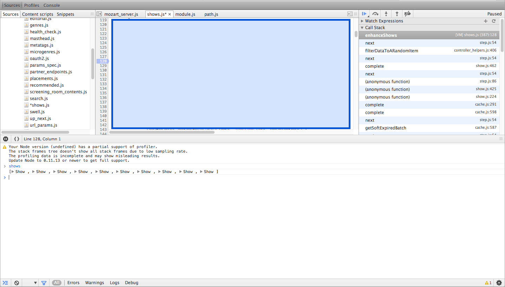
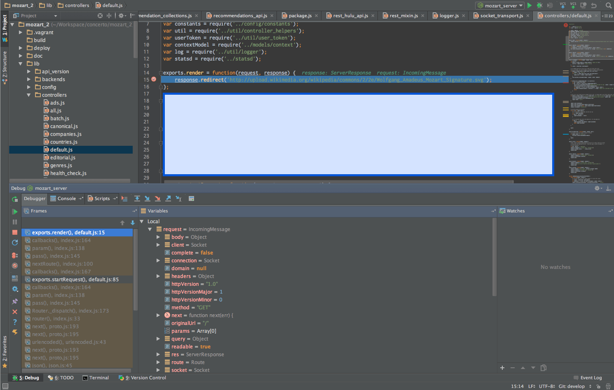
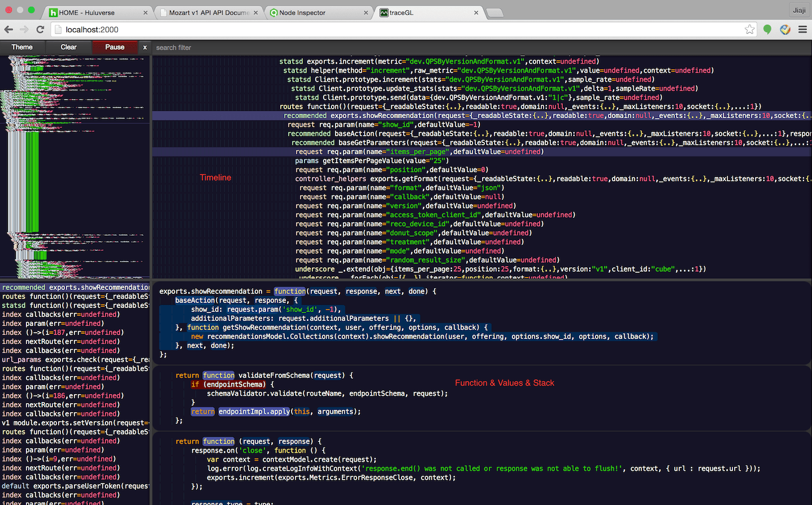
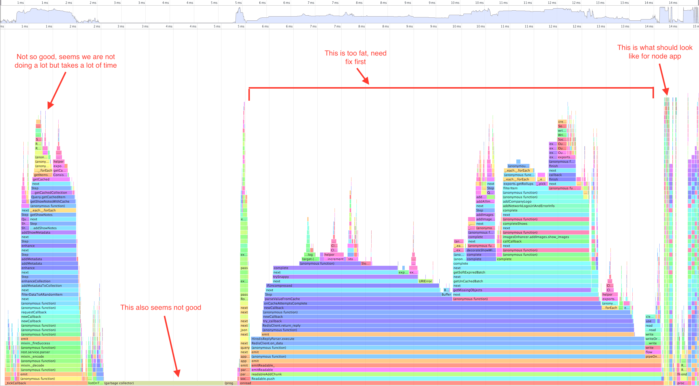
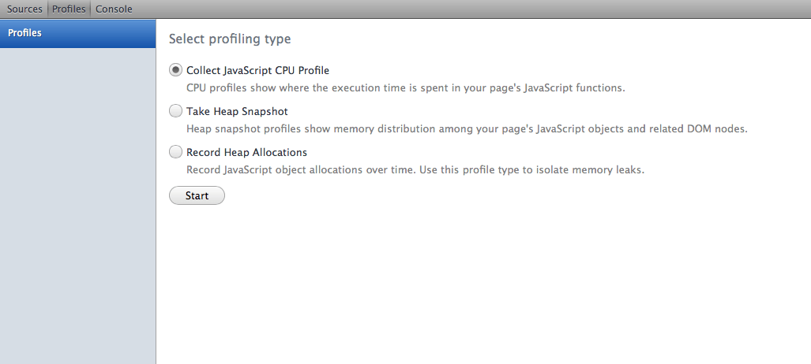
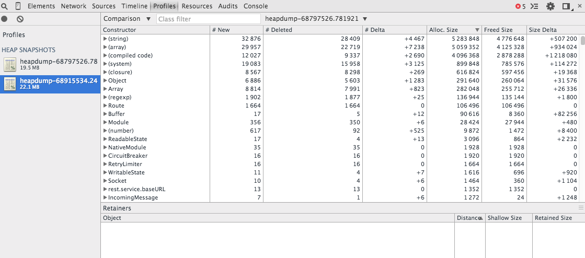

# Node Profiling Tools

<!--
  feature: nodejs-profiling/featurecopy.png
-->

At Hulu, we use Nodejs to build a **proxy** or **orchestration** service to expose APIs to our client applications in order to provide a unified interface (in API schema) which hides the complexity to deal with our versatile backend "micro-services".

The reason we choose Nodejs over other technologies is that its **asynchronized** nature perfectly fits the requirements of the service:

- Handling large number of concurrent clients;
- Requesting backend micro-services to get the data, where most of the time is spend on IO;
- Enhancing the backend response with data from other backend micro-services.

This is a typical front-tier API service that has **low CPU** consumption and **high concurrent IO** requirement.

However when you deploy the application to production, it is very likely that you would hit CPU bottleneck if you are not careful enough when writing code. Javascript is so flexible that can easily get you trapped into performance problem if you don't understand the execution engine (v8) well enough. Recently, I spent a lot of time doing profiling and investigating the performance issues of our service.

In this post, I'll list some tools and techniques I have used to profile/debug Nodejs program for daily development and production trouble-shooting as a summary of the work I've done.

(We use MacOS X as development environment and Ubuntu server as production OS. The version of node we currently use is a custom build of v0.10.)

## Debugging Tools

### node-inspector

[node-inspector](https://github.com/node-inspector/node-inspector) is my favorite tool for Nodejs application trouble-shooting.

You can use `node-debug` command to launch your application so that it starts your application and the debugger in your browser. However my favorite way to launch the debugger is to have a separate debugger process and attach node applications to it on demand so that I can use a single debugger process to debug multiple node applications.

First launch node-inspector, I prefer to open a separate console and leave it there.

``` bash
$ node-inspector
Node Inspector v0.9.2
Visit http://127.0.0.1:8080/debug?port=5858 to start debugging.
```

Then add `--debug` flag to the node option to run the node application with debugger enabled, which by default listen on port 5858. You can change the port by providing a port number to the debug flag, as `--debug=<port>`.

``` bash
$ node --debug lib/mozart_server.js
debugger listening on port 5858
```

If you try to debug some issue when node app starts, you can change `--debug` to `--debug-brk` so that your app starts in paused status.

After your app is started, you can visit the URL `http://127.0.0.1:8080/debug?port=<port>` to debug your application, just like in any IDE. 



node-inspector can also be used remotely so that you can debug your applications on production servers.

### WebStorm (spy-js)

Recently I used [WebStorm](https://www.jetbrains.com/webstorm/) a lot for javascript development. People always debate about whether a good programmer should use IDE or plain text editor (especially VIM, emacs). I don't see any value in such debate, as a pragmatic developer, I just use the best tools I can find to get things done.

WebStorm comes with a really good debugger for Nodejs applications based on their open source javascript tracing library [spy-js](https://github.com/spy-js/spy-js). With IDE's magic, you can start your server and set break points in the code in one place, the overall feature might be similar as node-inspector, but life gets much easier.



Besides the debugger, it also has good IDE features like auto-completion, smart code inspection, refactor and code navigation. It definitely worth you $99 to get the tool if you do professional programming in javascript.

### TraceGL

[TraceGL](https://github.com/traceglMPL/tracegl) is a tracing tool to log every statement your Nodejs app is executing. It is used when I want to know what exactly happens during the execution, especially when debugging timers, which is really difficult to manage using regular debuggers, because attaching the debugger will stop the execution and thus changing timers' behavior.

TraceGL is very easy to setup, just clone the repository and follow instructions to build the `tracegl.js` lib, put it somewhere makes you comfortable to access, like `~/Workspace/tools/tracegl.js`. Then start your node application using the following command.

``` bash
$ node ~/Workspace/tools/tracegl lib/mozart_server.js
[trace.GL] See your code.
[trace.GL] WebGL trace UI: http://0.0.0.0:2000
```

Then open `http://localhost:2000` in your browser, you will see something like the below image. TraceGL outputs each executed statement in time order and the value of function arguments with the corresponding stack, which is really useful.



## CPU Profiling

Now let's talk about tools to profile your applications. During development it is critical to understand the bottleneck of your application, for any application that do serious business. Javascript programs can easily get slow and eating a lot of CPU if you don't pay attention. Even good professional programmers can get into these problems. So when such problem happen it's important to know how to find the culprit.

### Frame Graph

Frame Graph is the first thing I want to get when I start to find CPU bottlenecks. It gives you a good overview understanding of where your application spends most of the time. Below is a screen-shot of the Frame Graph of our application. I recently identified a lot of performance issues using this tool.



Frame Graph is obtained by sampling your running program, getting the call stacks and accumulating them into the graph, in the graph:

- The x-axis stands for the accumulated "ticks" of the sampled function. Each block represents a javascript function. The longer the block, the more CPU it (and its children) consumes. Although there is a time line in the chart, don't be cheated, the length of the block has no meaning in the real time perspective. Also the relative position of the bricks does not indicate the execution sequence. Blocks on the left are not necessarily executed before the blocks on the right.
- The y-axis stands for the depth of call stack. The higher the block, the deeper it is in the call stack. It also shows the parent-children relationship of the functions.

Most of the tutorials, blogs, articles I can find demand you to have some OS that support DTrace to generate this graph. Unfortunately, most of the time I work in Linux or MacOS, which has no full DTrace support. The good news is, it turns out that we don't need DTrace to get this! (as long as you only concern the javascript space, not inside v8 native space) node-inspector comes to the rescue again!

Launch your node-inspector, boot up your server with debug flag and open the web debugger. See this "Profiles" tab? That's it!



I won't spend more time to explain on how to use it though :) Just try it yourself.

Moreover, node-inspector's sampling is really light-weight and it's very good for CPU bound performance tuning.

### v8 Profile log

Sometimes you need to do more subtle inspection, such as finding if the method is optimized or not by v8, knowing what Nodejs is doing in native space. Then you need the v8 profile log.

To generate the v8 profile log is easy. Just add `--prof` to the node command line parameter.

``` bash
$ node --prof lib/mozart_server.js
```

Then Nodejs will generate a file `v8.log` in the current folder.

The difficult part is how to analyze the log file. According the tutorial, you need to find a proper `mac-tick-processor` to parse the log file. Unfortunately, I have never successfully built one, because the v8 version embedded in node v0.10 is too old and it just can't be built it in the latest OSX environment without changing the source code. That's painful.

After some research, I found a particular useful tool called [node-tick](https://github.com/sidorares/node-tick) that can do the trick. node-tick is a pure javascript application that doesn't require you to build. Below is an excerpt from the output of node-tick, which shows a suspicious unknown lib that consumes 15% of the CPU time.

``` bash
[Unknown]:
   ticks  total  nonlib   name
   5790   14.9%
 
 [Shared libraries]:
   ticks  total  nonlib   name
  25474   65.7%    0.0%  /Users/jiaji.zhou/.nvm/v0.10.24/bin/node
   2634    6.8%    0.0%  /usr/lib/system/libsystem_kernel.dylib
   1400    3.6%    0.0%  /usr/lib/system/libsystem_platform.dylib
    716    1.8%    0.0%  /usr/lib/system/libsystem_c.dylib
    537    1.4%    0.0%  /usr/lib/system/libsystem_malloc.dylib
    232    0.6%    0.0%  /usr/lib/system/libsystem_pthread.dylib
     33    0.1%    0.0%  /usr/lib/libc++abi.dylib
     13    0.0%    0.0%  /usr/lib/system/libsystem_m.dylib
     10    0.0%    0.0%  /usr/lib/libstdc++.6.dylib
```

I'm not going to go into the details of how to understand the v8 log. Here are some references if you are interested:

- [https://github.com/thlorenz/v8-perf/blob/master/performance-profiling.md](https://github.com/thlorenz/v8-perf/blob/master/performance-profiling.md)
- [http://floitsch.blogspot.com/2012/03/optimizing-for-v8-memory-prof.html](http://floitsch.blogspot.com/2012/03/optimizing-for-v8-memory-prof.html)

### Profiling on Production

Production is a serious business! Obviously, you should not add `--debug` flag to your process. Joyent has built a lot of tools that require DTrace functionality and their SmartOS to run well, but we are running Linux and I don't see any potential plan to change it to SmartOS, it sucks.

There are some profiling and monitoring SaaS for Nodejs out there, such as [nodetime](https://nodetime.com), [strongloop](https://strongloop.com/node-js/performance-monitoring/), [PM2](https://www.npmjs.com/package/pm2), etc. I like none of them, because it not only will introduce an external network/service dependency but also will leak your production data to a 3rd party, which looks awkward and stupid if you are doing serious business.

What we currently do is, setting up an environment as close to production as possible and constantly replaying production traffic to that environment, and using node-inspector to do profiling on that environment if necessary. Also we heavily rely on production metrics. We emit massive amount of metrics.

Recently, I found a tool called [node-stap](https://github.com/uber/node-stap), developed by Uber, which looks promising. However SystemTap is intrusive and has impact on the system, I haven't tried it on production. I'm doing some experiments on it and might write a post about it later.

## Memory Profiling

### Trace GC and Heap size

Nodejs has a pretty decent Garbage Collector, so usually you don't need to worry much about the GC parameters.

A particular optimization we do on production is to enable `--expose-gc` and `--nouse-idle-notification` flag so that we can do manual GC when necessary. Here is a good reference about the effect of `--expose-gc` and `--nouse-idle-notification` to the system performance under high load: [http://sysmagazine.com/posts/123154/](http://sysmagazine.com/posts/123154/).

On the other hand, GC activity log is a good resource for performance trouble shooting. It is better to record that. To enable GC log, you need to add the `--trace_gc` flag to the node command. See the below example. One thing to note: the number in the parenthesis is the total memory allocated, the number outside the parenthesis is the total used memory.

When system performance is low, you may check the log to see if there are excessive GC events at the same time. If so, you may need to investigate how to reduce memory usage.

``` bash
$ node --debug --trace_gc --expose-gc lib/mozart_server.js
debugger listening on port 5858
[94062]       30 ms: Scavenge 2.0 (34.0) -> 1.7 (36.0) MB, 0 ms [Runtime::PerformGC].
[94062]       42 ms: Scavenge 2.6 (38.0) -> 2.1 (38.0) MB, 1 ms [allocation failure].
[94062]       51 ms: Scavenge 3.1 (38.0) -> 2.5 (38.0) MB, 0 ms [allocation failure].
[94062]       67 ms: Scavenge 4.6 (38.0) -> 3.3 (38.0) MB, 0 ms [Runtime::PerformGC].
[94062]       90 ms: Scavenge 5.5 (39.0) -> 4.5 (39.0) MB, 1 ms [allocation failure].
[94062]      111 ms: Scavenge 6.4 (39.0) -> 5.4 (40.0) MB, 1 ms [allocation failure].
[94062]      155 ms: Mark-sweep 9.4 (41.0) -> 5.6 (43.0) MB, 8 ms [allocation failure] [promotion limit reached].
[94062]      192 ms: Scavenge 10.2 (43.0) -> 7.4 (43.0) MB, 1 ms [Runtime::PerformGC].
[94062]      222 ms: Scavenge 10.8 (43.0) -> 8.7 (43.0) MB, 2 ms [Runtime::PerformGC].
[94062]      239 ms: Scavenge 12.6 (44.0) -> 10.9 (46.0) MB, 1 ms [allocation failure].
[94062]      287 ms: Scavenge 18.1 (46.0) -> 13.2 (47.0) MB, 2 ms [allocation failure].
[94062]      341 ms: Mark-sweep 19.7 (47.0) -> 12.3 (48.0) MB, 17 ms [allocation failure] [promotion limit reached].
```

To understand the GC space layout, you may add `--trace_gc_verbose` to show details for the size of each generation. This is useful when the problem you need to solve is subtle and you need to understand the distribution of new generation and old generation. For example:

``` bash
[93955]      323 ms: Scavenge 10.8 (43.0) -> 8.7 (43.0) MB, 2 ms [Runtime::PerformGC].
[93955] Memory allocator,   used:  44048 KB, available: 1455088 KB
[93955] New space,          used:    917 KB, available:   3178 KB, committed:   8192 KB
[93955] Old pointers,       used:   3249 KB, available:    278 KB, committed:   3535 KB
[93955] Old data space,     used:   2795 KB, available:    106 KB, committed:   3215 KB
[93955] Code space,         used:   1362 KB, available:    115 KB, committed:   1992 KB
[93955] Map space,          used:    562 KB, available:    573 KB, committed:   1135 KB
[93955] Cell space,         used:     39 KB, available:      0 KB, committed:    128 KB
[93955] Large object space, used:      0 KB, available: 1454047 KB, committed:      0 KB
[93955] All spaces,         used:   8926 KB, available:   4251 KB, committed:  18198 KB
[93955] Total time spent in GC  : 12 ms
```

Here is a good article about how GC works in Nodejs: [https://strongloop.com/strongblog/node-js-performance-garbage-collection/](https://strongloop.com/strongblog/node-js-performance-garbage-collection/)

Another common metric we monitor is the heap size, which can be obtained by calling `process.memoryUsage().heapUsed`.

### Profiling on Production

Sometimes, you may find abnormal memory usage on production. There is a good library to get heap dump on production: [heapdump](https://github.com/bnoordhuis/node-heapdump). You can require heapdump in you application and send signal to your process to get heap dump when necessary. This is extremely useful to investigate problems on production.

After you get the heap dump, you can use Chrome browser to load the dump and do comparison between different dumps to find potential memory leaks. See below image as an example.



## General Nodejs Performance Investigation Strategy

With the above tools and utilities, you should have enough power to investigate Nodejs performance problems. Here are some general strategies you can follow.

- **Find the bottleneck.** First of all you need to understand what's the bottleneck of your system. Is it bandwidth, memory or CPU?
- **Focus on a single code path at a time.** After you know your bottleneck, try to use some consistent way to stress your system and using the profiling tools to get the idea why the system is under perform in such fixed condition. As an example, we have a lot of API endpoints in our Nodejs service. When I do performance investigation, I will first find the slowest endpoint. Then focus on that endpoint to start investigation.
- **Start from the most significant issue.** If some function takes 50% of your server's resource (CPU), when you optimize it by 30%, you get 15% total increase. On the other hand, if some function only takes 10% of your total resource, even if you totally eliminate the function, you still can only get 10%. So focus on most significant issue first.
- **Divide and Conquer.** Most of the time the problem you are solving is too complex, so you need to break down the problem into small problems. Writing small benchmark scripts to understand how you can improve for each small problem.
- **Metric, metric, metric!** On production, there is limited way to get information from your nodejs application. So please report as many metrics as possible when you write code. However please also profile how much cost you spend on reporting metrics, sometimes you may find it's ridiculously high, then you need to find a way to optimize the reporting.
