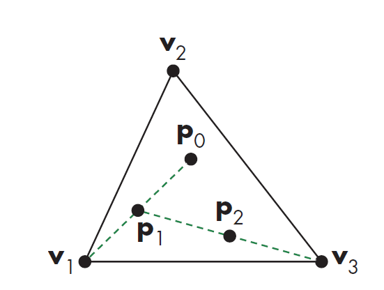

# Chaos Game

## A Random Process

最近在看 Interactive Computer Graphics: A Top-Down Approach with WebGL ，里面看到一个很有意思的几何问题，大致是这样的：

1. 在平面上给定一个正三角形，三角形的三个顶点分别为V1, V2, V3
2. 在三角形内任意取一个点P
3. 随机从V1, V2, V3中选择一个点，Vx，取Vx和P的中点，记为点Q，然后在平面上标记点Q
4. 将Q视为新的点P，然后回到步骤3

请问重复上述步骤N次之后， P所构成的点集在平面上呈什么分布。

刚看到这个过程描述觉得这过程好随机，很难想象会有什么规律。看到这里要是你不知道结果的话也可以猜一猜。

## The Final Destination

确实很好奇，就实现了一下，被结果震惊了。后来去wiki上查了一下，这个图案叫做Sierpinski Triangle，整个过程非常有意思，无论起点是否在最后的收敛的图案上，整个循环过程都会迅速收敛，形成一个很好看的分形结构。具有这种性质的过程叫做Chaos Game。另外这个性质在任意三角形上都成立，不一定非要正三角形。

在jsfiddler上放了一个实现，拖动slider可以控制程序循环几个周期。

<iframe width="100%" height="800" src="//jsfiddle.net/1cy6Lr4z/6/embedded/result/" allowpaymentrequest allowfullscreen="allowfullscreen" frameborder="0"></iframe>
